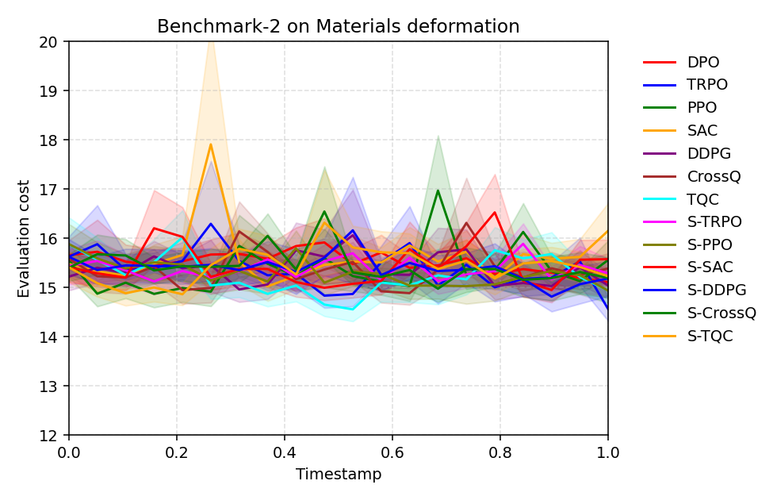
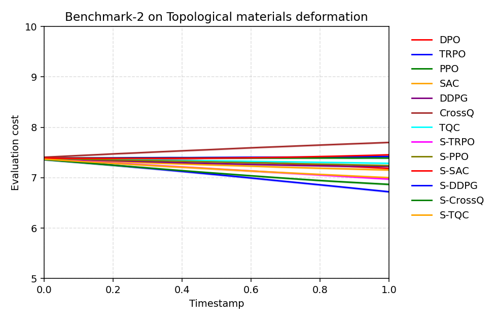
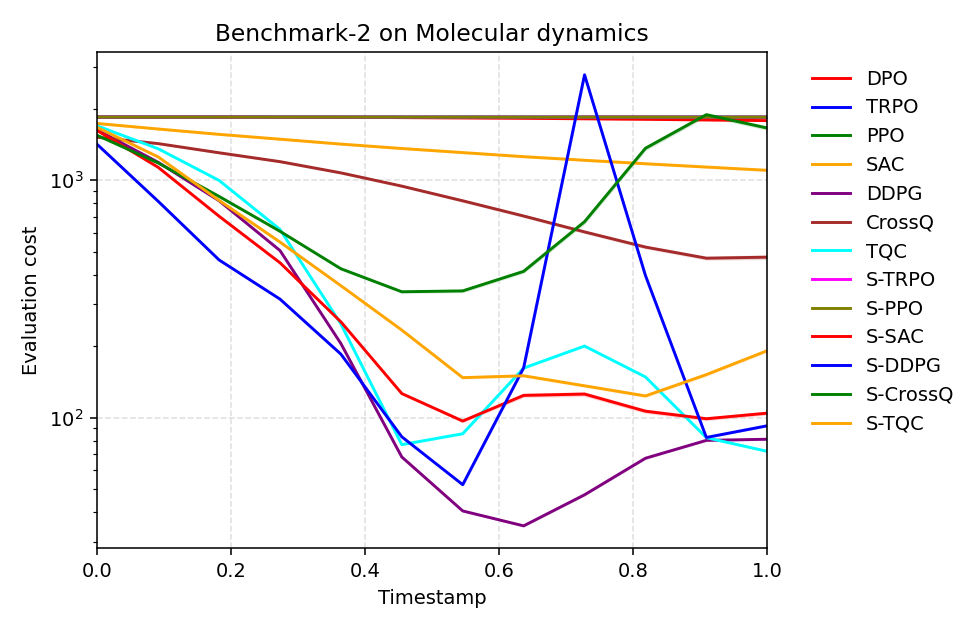
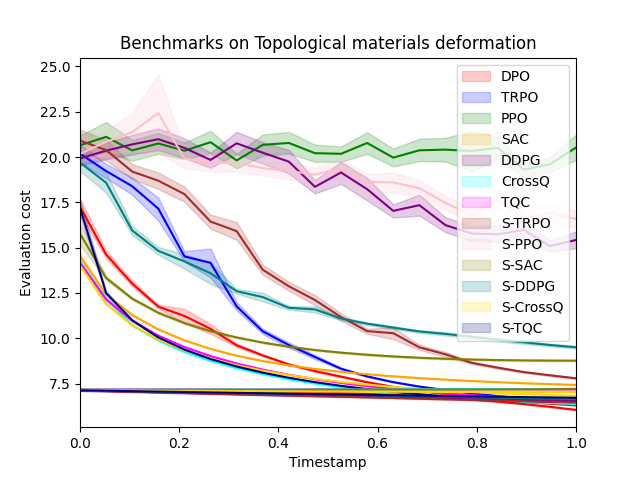
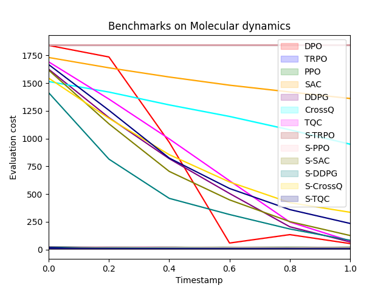

# DPO: Differential Policy Optimization

[](https://arxiv.org/abs/2404.15617)
[](./LICENSE)

## Introduction
- **Differential Policy Optimization (DPO)** introduces a differential formulation of reinforcement learning designed to improve trajectory consistency and sample efficiency in continuous control problems. Unlike conventional RL methods that rely on value-based formulations (Bellman equations, Q/V-functions), our method is based on a **dual, differential perspective** rooted in continuous-time control theory. Standard RL can be viewed as a discrete approximation of a control-theoretic integral formulation, which in turn admits a differential dual. We focus on building a **policy optimization method grounded in this differential dual**, enhanced by a **Hamiltonian prior**.
---

## Results Summary of Benchmarks 2
# Reinforcement Learning Algorithm Benchmark Results

This repository contains benchmark results for various reinforcement learning algorithms tested on three scientific simulation tasks.

## Overview

The benchmark evaluates 14 different algorithms, including standard implementations (DPO, TRPO, PPO, SAC, DDPG, CrossQ, TQC) and their stabilized variants (prefixed with S-).

## Performance Tables

### Materials Deformation (Sorted by Performance)
| Algorithm | Materials Deformation |
|-----------|----------------------|
| **TRPO**  | **14.558 ± 15.022**  |
| S-PPO     | 14.934 ± 15.519      |
| TQC       | 14.939 ± 15.735      |
| DDPG      | 15.037 ± 17.222      |
| DPO       | 15.108 ± 17.706      |
| S-DDPG    | 15.187 ± 22.364      |
| S-CrossQ  | 15.195 ± 25.169      |
| S-TQC     | 15.228 ± 16.680      |
| S-TRPO    | 15.289 ± 17.230      |
| CrossQ    | 15.388 ± 19.239      |
| S-SAC     | 15.578 ± 24.315      |
| PPO       | 15.565 ± 25.724      |
| SAC       | 16.159 ± 35.383      |

### Topological Materials Deformation (Sorted by Performance)
| Algorithm | Topological Materials Deformation |
|-----------|----------------------------------|
| **S-DDPG**| **6.722 ± 1.069**                |
| S-CrossQ  | 6.869 ± 0.982                    |
| S-TRPO    | 6.974 ± 1.009                    |
| S-TQC     | 7.002 ± 0.971                    |
| SAC       | 7.153 ± 0.914                    |
| DPO       | 7.183 ± 0.908                    |
| DDPG      | 7.223 ± 1.105                    |
| S-PPO     | 7.242 ± 0.930                    |
| TQC       | 7.287 ± 0.894                    |
| PPO       | 7.391 ± 0.899                    |
| TRPO      | 7.422 ± 0.919                    |
| S-SAC     | 7.456 ± 0.947                    |
| CrossQ    | 7.701 ± 0.846                    |

### Molecular Dynamics (Sorted by Performance)
| Algorithm | Molecular Dynamics     |
|-----------|------------------------|
| **TQC**   | **72.035 ± 0.006**     |
| DDPG      | 81.007 ± 0.006         |
| S-DDPG    | 92.320 ± 0.011         |
| S-SAC     | 104.333 ± 60.799       |
| S-TQC     | 191.279 ± 90.721       |
| CrossQ    | 473.610 ± 434.832      |
| SAC       | 1099.944 ± 219.568     |
| S-CrossQ  | 1657.196 ± 1337.184    |
| DPO       | 1780.812 ± 0.395       |
| S-TRPO    | 1841.956 ± 0.310       |
| PPO       | 1842.024 ± 0.285       |
| S-PPO     | 1842.029 ± 0.279       |
| TRPO      | 1842.032 ± 0.280       |

### Evaluation costs over time steps across different episodes are shown in:

<div align="center">
  
  
  
</div>

## Key Findings

Different algorithms excel in different domains:
- **TRPO**: Best for general materials deformation
- **S-DDPG**: Superior for topological materials deformation
- **TQC**: Exceptional for molecular dynamics simulations

The stabilized variants (S-prefix) demonstrated improved performance in topological materials tasks, suggesting that stability-enhancing modifications are beneficial for certain problem domains.

For molecular dynamics, algorithm selection is particularly critical, with performance differences spanning orders of magnitude.

## Results Summary of Benchmarks 1

### Shape Boundary Environment

# Algorithm Performance Comparison

## Materials Deformation (Sorted by Performance)
| Algorithm | Materials Deformation |
|-----------|----------------------|
| **DPO**   | **6.296 ± 0.048**    |
| CrossQ    | 6.366 ± 0.028        |
| S-TQC     | 6.470 ± 0.027        |
| TRPO      | 6.469 ± 0.022        |
| TQC       | 6.589 ± 0.048        |
| S-CrossQ  | 6.829 ± 0.079        |
| SAC       | 7.424 ± 0.047        |
| S-TRPO    | 7.789 ± 0.114        |
| S-SAC     | 8.762 ± 0.105        |
| S-DDPG    | 9.503 ± 0.210        |
| DDPG      | 15.421 ± 1.471       |
| S-PPO     | 16.578 ± 0.909       |
| PPO       | 20.524 ± 1.795       |

## Topological Materials Deformation (Sorted by Performance)
| Algorithm | Topological Materials Deformation |
|-----------|----------------------------------|
| **DPO**   | **6.046 ± 0.083**                |
| S-TRPO    | 6.461 ± 0.084                    |
| DDPG      | 6.570 ± 0.082                    |
| S-DDPG    | 6.642 ± 0.124                    |
| S-TQC     | 6.715 ± 0.098                    |
| S-PPO     | 7.067 ± 0.126                    |
| SAC       | 7.077 ± 0.093                    |
| S-CrossQ  | 7.022 ± 0.117                    |
| PPO       | 7.154 ± 0.102                    |
| TRPO      | 7.167 ± 0.111                    |
| TQC       | 7.121 ± 0.086                    |
| S-SAC     | 7.200 ± 0.133                    |
| CrossQ    | 7.208 ± 0.121                    |

## Molecular Dynamics (Sorted by Performance)
| Algorithm | Molecular Dynamics   |
|-----------|---------------------|
| **DPO**   | **53.352 ± 0.055**  |
| DDPG      | 68.203 ± 0.000      |
| TQC       | 76.874 ± 0.001      |
| S-DDPG    | 82.946 ± 0.001      |
| S-SAC     | 126.130 ± 1.307     |
| S-TQC     | 234.922 ± 3.075     |
| S-CrossQ  | 335.683 ± 5.758     |
| CrossQ    | 949.697 ± 11.119    |
| SAC       | 1361.664 ± 12.808   |
| S-TRPO    | 1842.280 ± 0.009    |
| TRPO      | 1842.302 ± 0.009    |
| S-PPO     | 1842.303 ± 0.012    |
| PPO       | 1842.304 ± 0.010    |


### Key Features

- **Differential RL Framework:** Optimizes local trajectory dynamics directly, bypassing cumulative reward maximization.
- **Pointwise Convergence:** Theoretical convergence guarantees and sample complexity bounds.
- **Physics-Based Learning:** Performs well in tasks with Lagrangian rewards.

---

## Experiments

For experiments and benchmarkings, we designed tasks to reflect critical challenges in scientific modeling:

1. **Material Deformation (Surface Modeling)**  
   Time-evolving surfaces modeled with Bézier curves, optimized under trajectory-dependent cost functionals that capture geometry and physics over time.

2. **Topological Deformation (Grid-based setting)**  
   Control is applied on a coarse grid; cost is evaluated on a fine grid. This multi-scale approach reflects PDE-constrained optimization.

3. **Molecular Dynamics**  
   Atomistic systems represented as graphs; cost is based on nonlocal energy from atomic interactions.

## 📦 Setup Instructions
### 1. Clone the repo and install dependencies

```bash
git clone https://github.com/mpnguyen2/dpo.git
cd dpo
pip install -r requirements.txt
```

### 2. Install trained models for benchmarking
Due to size constraints, two folders ```models``` and ```benchmarks/models``` are not in the repo. Download them here:

📥 Download all files in two folders ```models``` and ```benchmarks/models``` from [Dropbox link](https://www.dropbox.com/scl/fo/n4tuy2jztqbenrh59n21l/AGOdr_YHHEo3pgBF6G39P38?rlkey=g65hut0hi53sodmwozpoidb7k&st=36s6cqca&dl=0)

Put those files into corresponding directories from the root directory:
```
dpo/
├── models/
├── benchmarks/
│   └── models/
```

## Benchmarking Results
### Sample Size
- ~100,000 steps for Materials and Topological Deformation  
- 10,000 steps for Molecular Dynamics due to expensive evaluations

## 🔁 Reproducing Benchmarks

To reproduce the benchmark performance and episode cost plots, run:

```bash
python benchmarks_run.py
```

Our benchmarking includes 15 algorithms, covering both standard and reward-reshaped variants for comprehensive evaluation. If you only need the baseline models — TRPO, PPO, SAC, and their reward-reshaped variants — you can modify ```benchmarks_run.py``` accordingly to skip the additional methods.

### Benchmark Summary (mean final evaluation cost)

| Algorithm     | Materials | Topological | Molecular |
|---------------|-----------|-------------|-----------|
| DPO           | **6.323**     | **6.061**       | **53.340**    |
| TRPO          | 6.503     | 7.230       | 1842.299  |
| PPO           | 19.229    | 7.089       | 1842.296  |
| SAC           | 7.528     | 6.959       | 1369.605  |
| S-TRPO        | 7.709     | **6.502**       | 1842.272  |
| S-PPO         | 15.117    | 7.151       | 1842.316  |
| S-SAC         | 8.686     | 7.267       | 126.449   |
| DDPG          | 15.917    | 6.578       | **68.204**    |
| CrossQ        | **6.414**     | 7.224       | 938.042   |
| TQC           | 6.676     | 7.086       | 76.874    |
| S-DDPG        | 9.543     | 6.684       | 82.946    |
| S-CrossQ      | 6.953     | 7.059       | 331.112   |
| S-TQC         | 6.523     | 6.704       | 236.847   |
| PILCO         | 8.012     | 7.312       | 1759.384  |
| iLQR          | 9.187     | 7.165       | 1843.147  |


### Evaluation costs over time steps across different episodes are shown in:

<div align="center">
  
  
  
</div>

### Memory Usage

Models are lightweight. Example sizes:

| Algorithm | Materials (MB) | Topological (MB) | Molecular (MB) |
|-----------|----------------|------------------|----------------|
| DPO       | 0.17           | 0.66             | 0.17           |
| PPO       | 0.08           | 0.62             | 0.08           |
| SAC       | 0.25           | 2.86             | 0.25           |
| TQC       | 0.57           | 6.45             | 0.57           |
| DDPG      | 4.09           | 5.19             | 4.09           |

## Statistical Analysis on Benchmarking Results

We perform benchmarking using 10 different random seeds, with each seed generating over 200 test episodes.

The table below reports the **mean ± standard deviation** of final evaluation costs across 15 algorithms (and their variants).

| Algorithm     | Materials Deformation     | Topological Deformation     | Molecular Dynamics        |
|---------------|----------------------------|------------------------------|----------------------------|
| **DPO**       | **6.296 ± 0.048**          | **6.046 ± 0.083**            | **53.352 ± 0.055**         |
| TRPO          | 6.468 ± 0.021              | 7.156 ± 0.118                | 1842.302 ± 0.009           |
| PPO           | 19.913 ± 1.172             | 7.157 ± 0.111                | 1842.298 ± 0.012           |
| SAC           | 7.429 ± 0.043              | 7.069 ± 0.091                | 1369.663 ± 12.851          |
| DDPG          | 15.421 ± 1.471             | 6.570 ± 0.082                | **68.203 ± 0.001**         |
| **CrossQ**    | **6.365 ± 0.030**          | 7.212 ± 0.124                | 961.220 ± 14.949           |
| TQC           | 6.591 ± 0.048              | 7.123 ± 0.091                | 76.874 ± 0.001             |
| S-TRPO        | 7.782 ± 0.102              | **6.473 ± 0.093**            | 1842.285 ± 0.014           |
| S-PPO         | 16.995 ± 1.615             | 7.075 ± 0.101                | 1842.298 ± 0.009           |
| S-SAC         | 8.773 ± 0.124              | 7.212 ± 0.122                | 125.930 ± 1.229            |
| S-DDPG        | 9.503 ± 0.210              | 6.642 ± 0.124                | 82.946 ± 0.001             |
| S-CrossQ      | 6.827 ± 0.072              | 7.024 ± 0.113                | 333.757 ± 10.509           |
| S-TQC         | 6.468 ± 0.026              | 6.714 ± 0.096                | 231.981 ± 2.210            |
| PILCO         | 7.932 ± 0.112              | 7.365 ± 0.082                | 1753.437 ± 9.621           |
| iLQR          | 9.105 ± 0.189              | 7.198 ± 0.132                | 1843.120 ± 0.074           |

**DPO** demonstrates **statistically significant** improvements over all baselines in nearly all settings. The only exception is the first experiment (**Material Deformation**), where **DPO** and **CrossQ** exhibit comparable performance. Statistical comparisons are conducted using t-tests on seed-level means.

## File structure
```
dpo/
├── output/                  # Benchmark plots and evaluation costs
├── models/                 <- Download this folder from Dropbox link
├── benchmark/               # Benchmark code
│   └── models/             <- Download this folder from Dropbox link
├── *.py                     # Python Source code
├── benchmarks_run.py        # Runs all experiments
└── README.md
└── main.ipynb               # DPO training notebook
└── analysis.ipynb           # Misc analysis notebook
```

## Citation

If you find this work useful, please cite:

```bibtex
@article{dpo,
  title={DPO: Differential reinforcement learning with application to optimal configuration search},
  author={Chandrajit Bajaj and Minh Nguyen},
  journal={arXiv preprint arXiv:2404.15617},
  year={2024},
  eprint={2404.15617},
  archivePrefix={arXiv},
  primaryClass={cs.LG},
  url={https://arxiv.org/abs/2404.15617}
}
