# DPO: Differential Policy Optimization

## Introduction
**Differential Policy Optimization (DPO)** is a reinforcement learning method that helps systems move smoothly and efficiently from one state to another.

Unlike traditional RL, which learns by estimating long-term rewards, DPO focuses on making small, local improvements at each step. It uses ideas from physics and control theory to guide each action in a way that’s consistent with how real-world systems behave.

This makes DPO especially useful for problems where path matters, like deforming shapes, simulating physical systems, or planning smooth omvements, because it learns how to change things gradually and reliably.

## Environment Overview
DPO is evaluated on three challenging scientific computing tasks designed to test its performance under complex, simulation-defined objectives:

1. **Materials Deformation:**
Deformable 2D shapes represented by spline control points are optimized to match a target shape. The reward functional encourages smooth, structurally plausible deformations and penalizes geometric irregularities or oscillations.

2. **Topological Deformation:**
A coarse spatial grid is controlled while reward is computed on a finer resolution, mimicking multi-scale PDE problems. The environment encourages alignment between coarse control and high-resolution behavior, making this ideal for testing spatial generalization.

3. **Molecular Dynamics:**
The agent modifies atomic configurations to reach low-energy molecular conformations. The reward is computed via physics-based energy simulations (e.g., PyRosetta), testing the algorithm’s ability to handle nonlocal, highly structured dynamics.

## Statistical Analysis on Benchmarking Results

We perform benchmarking using 10 different random seeds, with each seed generating over 200 test episodes.

The table below reports the **mean ± standard deviation** of final evaluation costs across 15 algorithms (and their variants).

| Algorithm     | Materials Deformation     | Topological Deformation     | Molecular Dynamics        |
|---------------|----------------------------|------------------------------|----------------------------|
| **DPO**       | **6.296 ± 0.048**          | **6.046 ± 0.083**            | **53.352 ± 0.055**         |
| TRPO          | 6.468 ± 0.021              | 7.156 ± 0.118                | 1842.302 ± 0.009           |
| PPO           | 19.913 ± 1.172             | 7.157 ± 0.111                | 1842.298 ± 0.012           |
| SAC           | 7.429 ± 0.043              | 7.069 ± 0.091                | 1369.663 ± 12.851          |
| DDPG          | 15.421 ± 1.471             | 6.570 ± 0.082                | **68.203 ± 0.001**         |
| **CrossQ**    | **6.365 ± 0.030**          | 7.212 ± 0.124                | 961.220 ± 14.949           |
| TQC           | 6.591 ± 0.048              | 7.123 ± 0.091                | 76.874 ± 0.001             |
| S-TRPO        | 7.782 ± 0.102              | **6.473 ± 0.093**            | 1842.285 ± 0.014           |
| S-PPO         | 16.995 ± 1.615             | 7.075 ± 0.101                | 1842.298 ± 0.009           |
| S-SAC         | 8.773 ± 0.124              | 7.212 ± 0.122                | 125.930 ± 1.229            |
| S-DDPG        | 9.503 ± 0.210              | 6.642 ± 0.124                | 82.946 ± 0.001             |
| S-CrossQ      | 6.827 ± 0.072              | 7.024 ± 0.113                | 333.757 ± 10.509           |
| S-TQC         | 6.468 ± 0.026              | 6.714 ± 0.096                | 231.981 ± 2.210            |
| PILCO         | 7.932 ± 0.112              | 7.365 ± 0.082                | 1753.437 ± 9.621           |
| iLQR          | 9.105 ± 0.189              | 7.198 ± 0.132                | 1843.120 ± 0.074           |

### Evaluation costs over time steps across different episodes are shown in:

  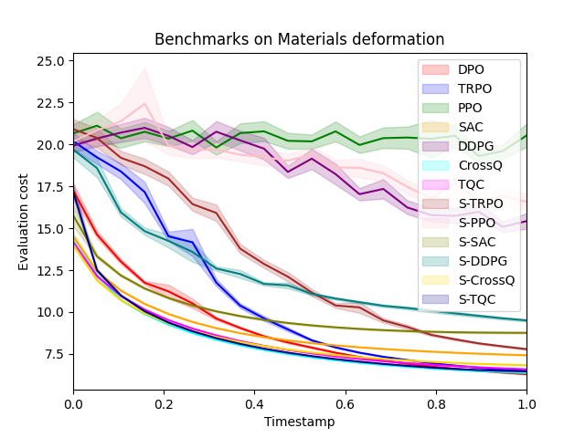
  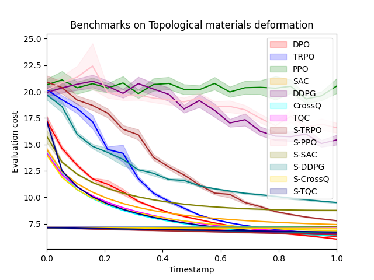
  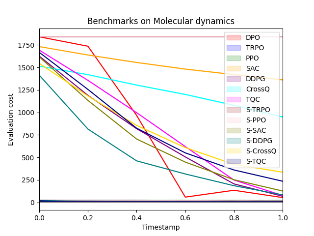

### What Are Splines?

Splines are smooth curves defined by a few adjustable points (control points). They efficiently represent shapes, making it easy to smoothly change from one shape to another. DPO optimizes these control points to achieve precise, stable transformations.

---

### Why Use Splines Here?

We use splines to:
- Represent 2D shapes as control point vectors
- Enable smooth, localized deformations
- Compute geometric properties like curvature and intersection
- Define rewards based on shape similarity and smoothness (e.g., spline distance to target)

This structure allows us to encode both the initial and target shape compactly, and then optimize their alignment over time.

---

### How Is DPO Applied?

We use **Differential Policy Optimization (DPO)** to learn a policy that **iteratively updates the spline control points** to transform an initial shape into a desired target shape.

The learning setup:
- **State**: current spline (i.e., control point vector)
- **Action**: pointwise adjustment to control points
- **Reward**: penalizes shape mismatch, irregular curvature, intersection, or unstable triangulation (via circumball constraints)
- **Policy**: learned via DPO’s differential dual framework, which enables stable and sample-efficient updates

Because DPO works pointwise and incorporates a Hamiltonian prior, the resulting deformations are **physically consistent**, smooth, and converge quickly to the desired configuration.

---
## Demo 1: Initial implementation; slow and inaccurate alignment.
- Final shape does not align well with the target "E"
- Progression of spline is too slow
- Reward component and repulsion plot show sharp spikes
  - Indicates frequent intersection of control points
- Control points aren't even spaced out

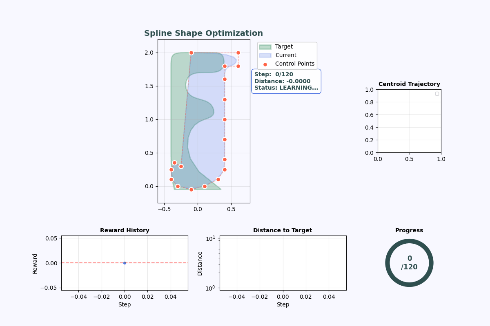

## Demo 2: Added knots/weights; improved shape accuracy and smoothness.
- **Added knots and weights**
  - **Knots** control how the curve bends and how smooth it looks
  - **Weights** control how strongly each point pulls the curve
- **Reward Components**:
  - **Control Points**: Penalizes distance between current and target spline shapes.
  - **Weights**: Penalizes error in NURBS weights.
  - **Knots**: Penalizes difference in internal knot positions.
  - **Velocity Penalty**: Penalizes rapid control point movement
  - **Energy Penalty**: Penalizes large-magnitude actions

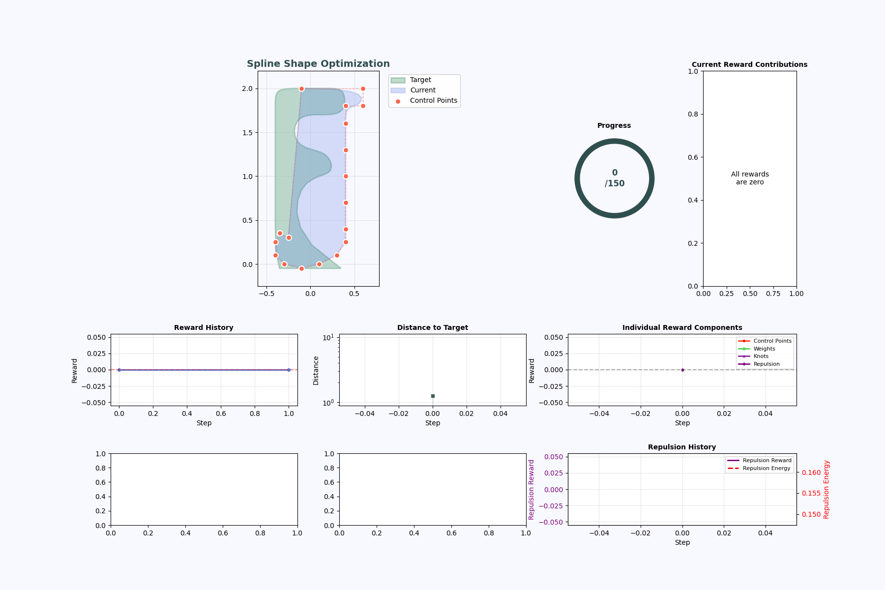

## Demo 3: Added Delaunay triangulation, repulsion; significantly improved spacing and stability.
- Displayed **Delaunay Triangulation** between each control point
  - Delaunay Triangulation efficiently connects nearby points to enforce geometric constraints.
- Added **more control points** for better spline shape
- Evenly **spaced out** control points along spline shape
- Added **more examples**

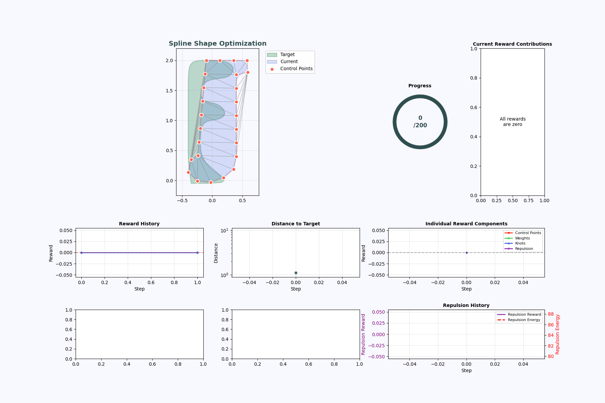

## Demo 4: Moved DPO to TACC
- So far used function to mimic DPO's actions
- Got actual DPO model working on splines
- Ran into a lot of problems
  - DPO wasn't correctly providing an action to splines
  - Dimensions between splines and trained DPO model match
  - Final shape didn't match

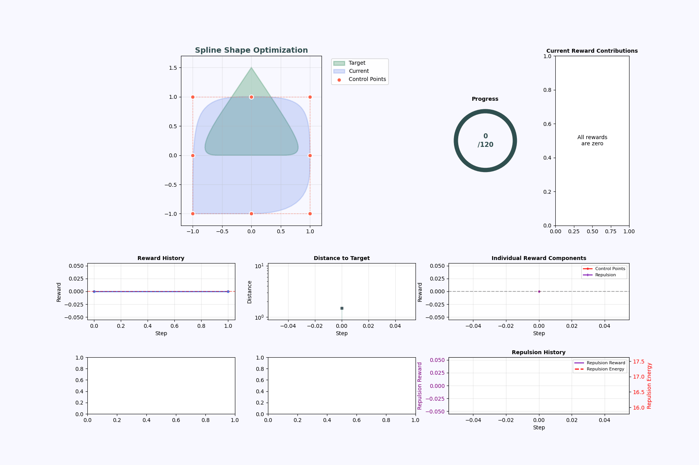
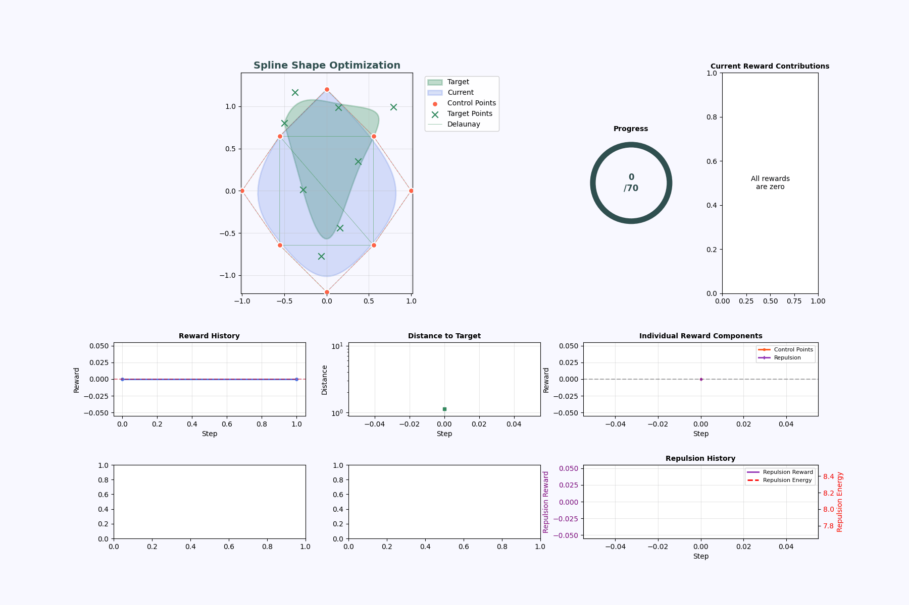
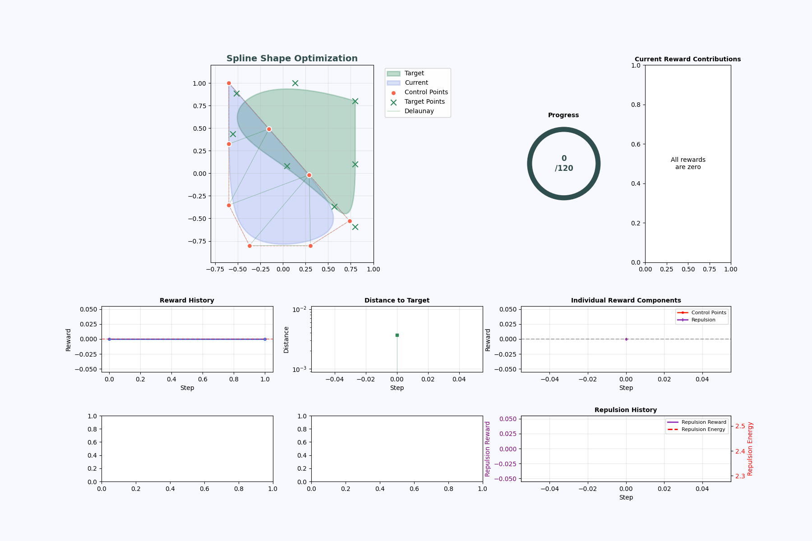

## Demo 5: Current Implementation of DPO on Splines

#### 1. Control Point Initialization & Matching
- Aligns initial and target splines by cyclically shifting target control points.
- Selects the shift that minimizes total distance to preserve spline structure.
- Ensures consistent control point ordering to prevent twisting or mismatches.

#### 2. Reward Function Design
- **Spline-to-Spline Distance**: 
  - Measures the geometric distance between the two full spline curves (not just their control points).  
    - More accurate because it compares actual shape, not just control point proximity.
- **Repulsion Energy**:  
  - Prevents clustering by adding repulsive forces between close, non-adjacent control points.
- **Edge Length Constraints**:  
  - Penalizes edges that are too short or too long to keep mesh quality consistent.
- **Triangle Quality**:  
  - Uses Delaunay triangulation to penalize triangles with bad circumradius ratios.

### 3. Loss Terms and Movement Penalties
- **Energy Penalty**:  
  Penalizes large control point movements to avoid jerky updates.
- **Velocity Penalty**:  
  Adds damping to smooth transitions between steps.

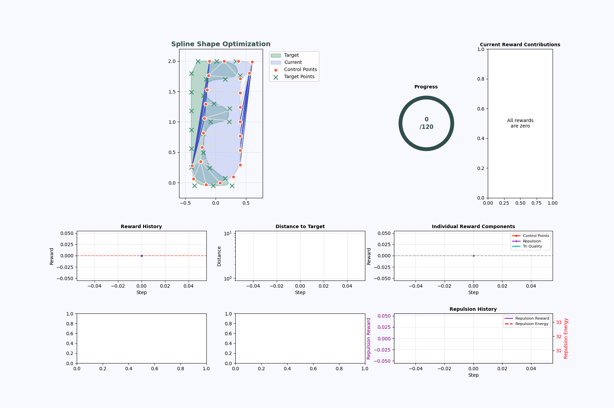
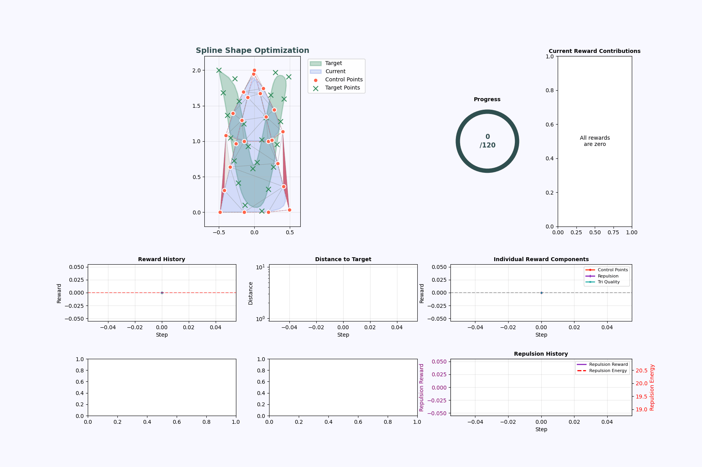
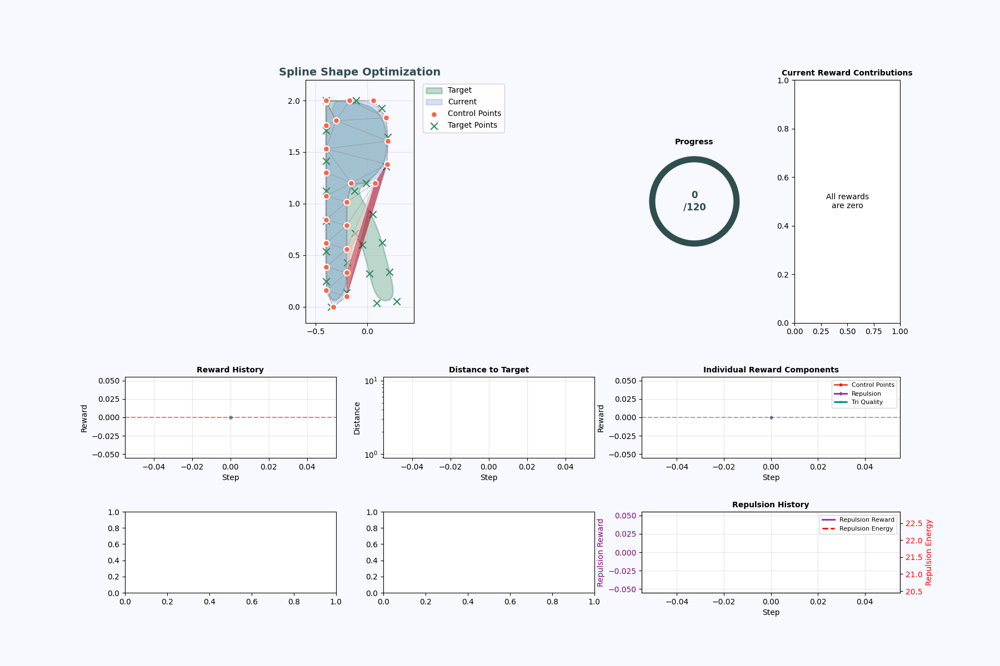
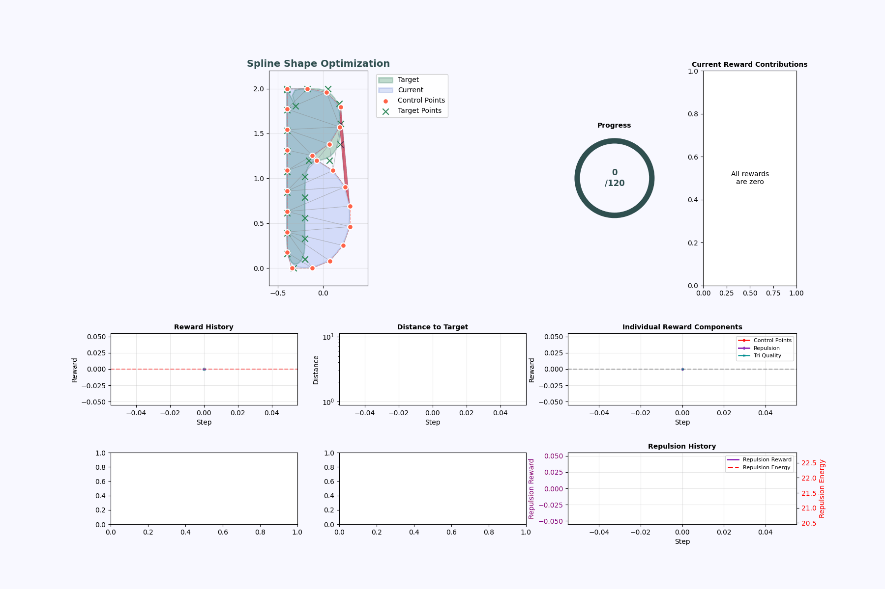

## How DPO + Splines Support TSM Scene Simulation

The use of splines and DPO goes beyond shape-matching, it directly supports simulating realistic, evolving environments for systems like the TSM radio network.

---

### 1. Splines Represent Physical Obstacles

Splines model the boundaries of environmental obstacles such as:

- Buildings and city blocks
- Trees and forest clusters
- Vehicles and terrain
- Rooftops or interference objects

These spline-defined shapes become physical barriers the TSM radios must navigate around.

---

### 2. DPO Enables Dynamic Scene Deformation

Using DPO, we can simulate **time-evolving** environments such as:

- A wall collapsing
- A truck shifting position
- A building rotating or being constructed

---

### 3. Impact on Path Planning

Spline obstacles determine **where TSM radios can or cannot travel**.  
DPO-generated environments directly influence:

- Communication coverage
- Line-of-sight interference
- Route selection for mobile radios

This makes spline deformation a **core component** of environment-aware signal routing.

---

### 4. Unreal Engine for 3D Deployment

These spline-based boundaries will be exported into 3D using **Unreal Engine**:

- Real-time rendering of deformed environments
- Terrain-aware signal propagation visualization
- Interactive, visually rich TSM testing demos

---

